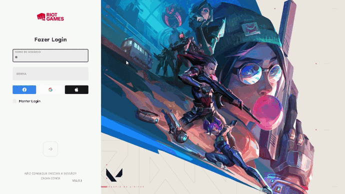

## 👀 Overview

Recriação da tela de Log In do jogo "Valorant" da Riot Games, que é o meu jogo favorito 😅, ele foi feito em HTML CSS e um pouco de Javascript.

Você pode acessá-lo [AQUI](https://vbrianb.github.io/Login_Valorant)

## 💡 Ideia 

O projeto foi com intuição de treinar validação de formulário, e claro... Porque eu queria muito 😄, é muito satisfatório criar projetos de coisas que nós amamos ❤️.

## ⚙️ Tools

 - HTML
 - CSS
 - JAVASCRIPT

 

## 🚀 Future

### Código

Penso em um futuro próximo recriar a tela do próprio client do jogo como uma SPA em react ou em html e css puro.

 
 

 
 
 
<h3 align="center"> Criado com muito ❤️ por <a href="https://github.com/VBrianB"> Vinicius Brian Bolzani</a></h2>
